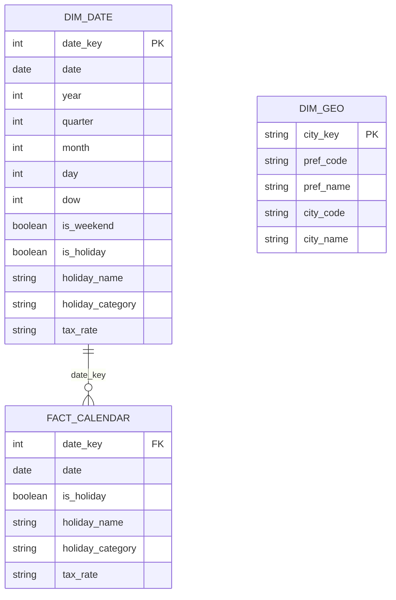

# project-a-jp-retail-pipeline

日本零售批次管線：官方來源清洗 **Bronze → Silver**，匯入 **星型模型 Gold（dim_date、dim_geo、fact_calendar）**。  
內建驗證與 Makefile，一鍵完成建置與驗證；提供 DuckDB 範例查詢可直接跑在 CSV 上。

---
## 星型模型（ER 圖）

```mermaid
erDiagram
  DIM_DATE {
    int date_key PK
    date date
    int year
    int quarter
    int month
    int day
    int dow
    boolean is_weekend
    boolean is_holiday
    string holiday_name
    string holiday_category
    string tax_rate
  }

  DIM_GEO {
    string city_key PK
    string pref_code
    string pref_name
    string city_code
    string city_name
  }

  FACT_CALENDAR {
    int date_key FK
    date date
    boolean is_holiday
    string holiday_name
    string holiday_category
    string tax_rate
  }

  DIM_DATE ||--o{ FACT_CALENDAR : date_key
```
