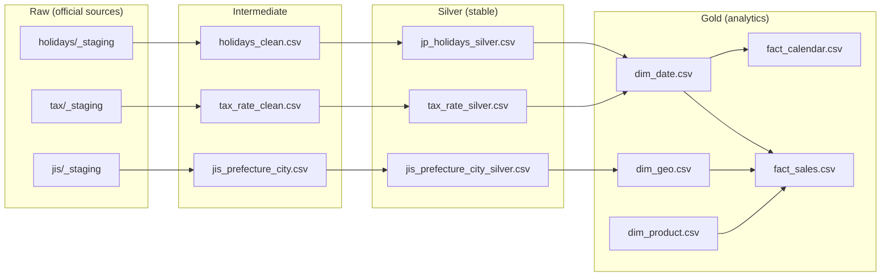
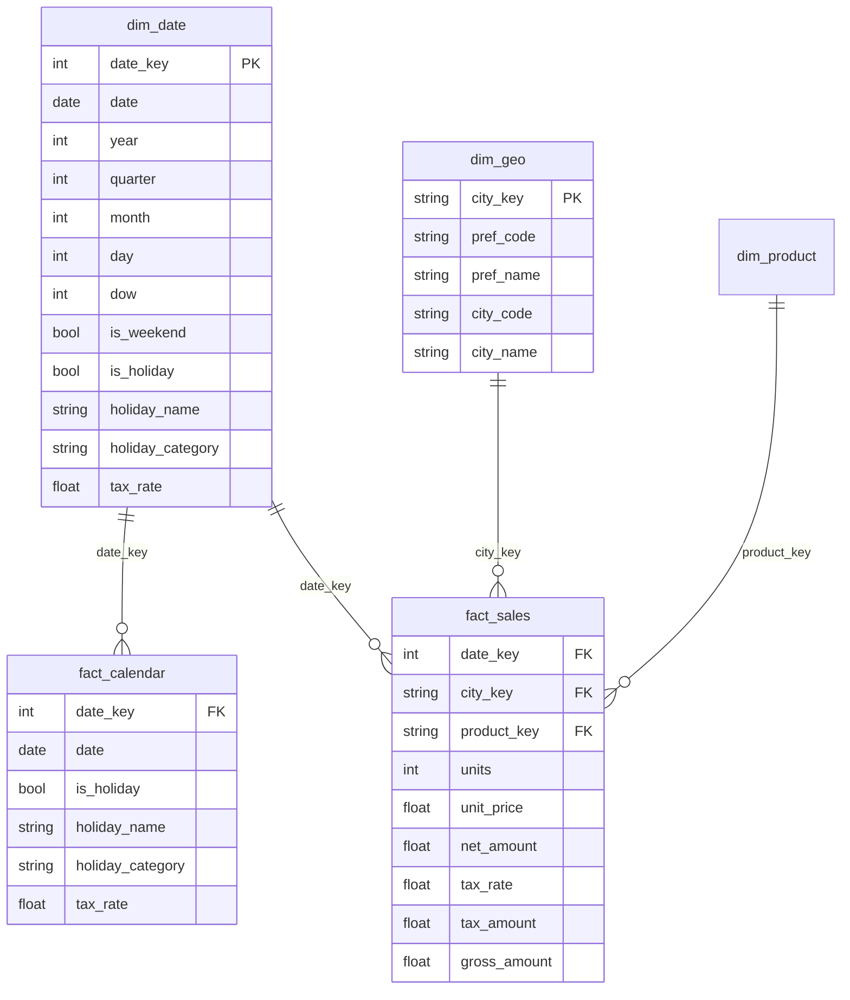

# Project A — Japan Retail Data Pipeline (MVP)

[](https://github.com/TraderKAI619/project-a-jp-retail-pipeline/actions/workflows/ci.yml)
[](https://www.python.org/downloads/)
[](LICENSE)


**English** | [**日本語**](README_ja.md)

A production-ready batch ETL pipeline for Japanese retail analytics using the Medallion architecture.
Integrates official government data (holidays, consumption tax history, JIS region codes) with synthetic sales for KPI demos.

Perfect for portfolios, learning DE patterns, or as a template for JP-specific analytics. 
## ⚡ 3-Minute Quick Start (Total ~3 min)
### Outputs (after build)
- `data/silver/{holidays,jis,tax}/...`
- `data/gold/dims/{dim_date,dim_geo,dim_product}.csv`
- `data/gold/facts/{fact_calendar,fact_sales}.csv`

```bash
# 1) Clone & Setup (~30s)
git clone https://github.com/TraderKAI619/project-a-jp-retail-pipeline.git
cd project-a-jp-retail-pipeline
python3 -m venv .venv && source .venv/bin/activate
pip install -r requirements.txt

# 2) Build Pipeline (~90s)
make everything

# 3) Run Demo Query (~30s)
python scripts/run_demo.py
```
**✨ You'll see:**
- ✅ `dim_date` ~25,000 rows
- ✅ `dim_geo` ~1,900 rows
- ✅ `fact_sales` ~146,000 rows
- 📊 Holiday vs non-holiday revenue comparison

## Features

### ✅ Real Japanese complexity
- 振替休日 (substitute holiday) & 国民の休日 covered
- Consumption tax SCD-2: 3% → 5% → 8% → 10% + 8% reduced rate

### ✅ Production patterns
- Medallion layers with validations at each step
- GitHub Actions CI (push + nightly)
- Full provenance in SOURCES.md

### ✅ Demo-ready analytics    
- ~140K synthetic sales rows with seasonality/holiday/tax effects
- Pre-built KPI queries: holiday lift, tax impact, geo trends

## Architecture
[📐 Full Architecture & ERD](docs/architecture.md)
The pipeline uses a **4-layer Medallion-style pattern** (Raw → Intermediate → Silver → Gold):

- **Raw**: official files as-is (holidays, JIS codes, tax history)
- **Intermediate**: encoding fixes, header normalization, de-duplication
- **Silver**: stable CSV schemas (data contracts) with basic constraints
- **Gold**: star schema (dims + facts) ready for BI tools




## Prerequisites
- **Python**: 3.10–3.12 (macOS/Linux/Windows)
- **pip**: for dependency management
- **(Optional)**: DuckDB CLI ≥ 0.9 or `pip install duckdb`
- **Disk**: < 50 MB (all layers + synthetic data)

## 💰 Cost & Resource Management (local-first)
**Compute**: 25–40 s build on a modern laptop；< 500 MB RAM  
**Cloud cost**: ¥0 — 100% runs locally

**Minimum permissions**
- ✅ local filesystem read/write, ✅ Python 3.10+
- ❌ no AWS/GCP/Azure, ❌ no DB credentials

**Optional — if deploying to AWS later (minimum S3 policy)**
```json
{
  "Version": "2012-10-17",
  "Statement": [{
    "Effect": "Allow",
    "Action": ["s3:GetObject","s3:PutObject","s3:ListBucket"],
    "Resource": ["arn:aws:s3:::your-bucket-name/*","arn:aws:s3:::your-bucket-name"]
  }]
}
```

## Demo Queries (DuckDB) 📊

- Holiday uplift → [`sql/kpi_holiday.sql`](sql/kpi_holiday.sql)
- Tax change impact → [`sql/kpi_tax_change.sql`](sql/kpi_tax_change.sql)
- Prefecture × month ranking → [`sql/kpi_pref_month.sql`](sql/kpi_pref_month.sql)

Use DuckDB CLI or Python `duckdb`.  
If your generator exports `revenue_jpy` (e.g., from `generate_fake_sales.sql`), replace `gross_amount` below with `revenue_jpy`.

### ① Holiday vs Non-holiday revenue uplift
```sql
WITH f AS (
  SELECT * FROM read_csv_auto('data/gold/facts/fact_sales.csv')
),
d AS (
  SELECT date_key, is_holiday
  FROM read_csv_auto('data/gold/dims/dim_date.csv')
)
SELECT is_holiday, SUM(gross_amount) AS revenue_jpy
FROM f JOIN d USING (date_key)
GROUP BY is_holiday
ORDER BY is_holiday;


**Example output**
```
is_holiday  revenue_jpy
FALSE       8,523,441
TRUE        9,871,223
```
*Note: numbers vary by seed; expect holiday > non-holiday.*

### ② Tax boundary (2019/10 change)
```sql
WITH f AS (
  SELECT * FROM read_csv_auto('data/gold/facts/fact_sales.csv')
),
d AS (
  SELECT date_key, tax_rate
  FROM read_csv_auto('data/gold/dims/dim_date.csv')
)
SELECT tax_rate,
       ROUND(SUM(gross_amount)/1e8, 2) AS rev_億日圓
FROM f JOIN d USING (date_key)
WHERE date_key BETWEEN 20180801 AND 20201231
GROUP BY tax_rate
ORDER BY tax_rate;
```
*Expected: 10% period slightly lower due to generator’s tax_penalty.*

### ③ Prefecture × month ranking
```sql
WITH f AS (
  SELECT * FROM read_csv_auto('data/gold/facts/fact_sales.csv')
),
d AS (
  SELECT date_key, CAST(date_key/100 AS INT) AS yyyymm
  FROM read_csv_auto('data/gold/dims/dim_date.csv')
),
g AS (
  SELECT city_key, pref_code, pref_name
  FROM read_csv_auto('data/gold/dims/dim_geo.csv')
)
SELECT g.pref_code, g.pref_name, d.yyyymm,
       ROUND(SUM(gross_amount)/1e8, 2) AS rev_億日圓
FROM f
JOIN d USING (date_key)
JOIN g USING (city_key)
GROUP BY 1,2,3
ORDER BY d.yyyymm, rev_億日圓 DESC;
```

## Data Model

Classic star schema with 3 dimensions and 2 fact tables (calendar + sales).


## Project Structure (excerpt)
```
data/
  raw_official/{holidays,jis,tax}/_staging/
  intermediate/{holidays,jis,tax}/...
  silver/{holidays,jis,tax}/...
  gold/
    dims/{dim_date,dim_geo,dim_product}.csv
    facts/{fact_calendar,fact_sales}.csv
notebooks/{demo_duckdb.sql, demo_sales.sql, generate_fake_sales.sql}
scripts/*.py
```

## Make Targets
```
make silver          # intermediate -> silver
make validate        # validate silver (schema, dates, unique keys)
make gold            # silver -> gold (adds synthetic product/sales)
make validate_gold   # gold checks (PK dup, negative amounts, row-count sanity)
make everything      # all of the above
```

Validations & CI/CD

Silver: required columns, date parseability, uniqueness（e.g., city_code）

Gold: PK duplicates, negative amounts guard, row-count sanity

GitHub Actions

CI on push/PR → make everything

Nightly ETL (cron) → refresh & keep green

Data Provenance

SOURCES.md records URLs, retrieval time (JST), file size & SHA256.

Update SHA quickly:

shasum -a 256 data/raw_official/tax/_staging/tax_rate_history.csv

## Known limitations
- Encoding edge cases（CP932/UTF-8 混用）仍在觀察與修補中  
- 稅率邊界（2019/10 的 8%→10%、以及 8% 輕減稅率）仍有極端值檢核調整空間  
- Demo 數值受亂數種子影響，請以查詢邏輯與趨勢為準

Troubleshooting
Symptom	Likely cause	Fix
FileNotFoundError	Running outside repo root or _staging missing	Run from repo root; place official source files under data/raw_official/.../_staging/
UnicodeDecodeError	JP encoding variance in raw files	Built-in readers try multiple encodings; if it persists, re-save as UTF-8 first
Gold tables empty	Silver not built yet	Run make everything, confirm silver CSVs exist
Duplicate keys	Upstream duplicates or mixed versions	clean_* de-dups; if still present, verify upstream file version & refresh
Roadmap

Next (MVP+) — why it matters

 dbt port → industry-standard modeling/tests & easier CI

 dim_store + mapping to JIS → city/store cuts & store-level KPIs

 Export diagrams to /docs → easier onboarding (rendered PNGs)

Future

 Incremental loads → production-scale efficiency & cost control

 RLS / Column Mask demo → multi-tenant security patterns

 JAN checksum & name-normalization tests → realistic data-quality edge cases

License

MIT — see LICENSE
.
