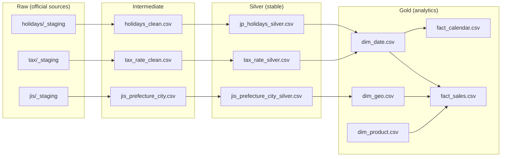
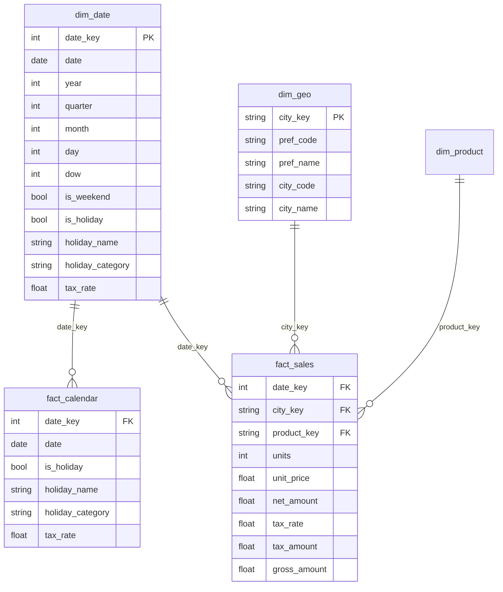

# Project A — 日本向け小売データパイプライン (MVP)
[](https://github.com/TraderKAI619/project-a-jp-retail-pipeline/actions)
[](https://www.python.org/downloads/)
[](LICENSE)

**日本語** | [**English**](README.md) | [**繁體中文**](README_zh.md)

メダリオンアーキテクチャで構築した、日本の小売分析向けバッチETLパイプライン。内閣府の祝日、消費税履歴（SCD-2）、JIS 地域コードと合成売上データを統合し、KPI デモを再現可能にします。

---

## ⚡ 3分クイックスタート
```bash
# 1) Clone & Setup (~30s)
git clone https://github.com/TraderKAI619/project-a-jp-retail-pipeline.git
cd project-a-jp-retail-pipeline
python3 -m venv .venv && source .venv/bin/activate
pip install -r requirements.txt

# 2) Build Pipeline (~90s)
make everything

# 3) Demo Query (~30s)
python scripts/run_demo.py
```
出力物 (build 後)

data/silver/{holidays,jis,tax}/...

data/gold/dims/{dim_date,dim_geo,dim_product}.csv

data/gold/facts/{fact_calendar,fact_sales}.csv

見えるはずの結果

✅ dim_date 約 25,000 行 / ✅ dim_geo 約 1,900 行 / ✅ fact_sales 約 146,000 行

📊 祝日 vs 平日の売上比較

特徴
✅ 日本固有の複雑性：振替休日・国民の休日、消費税 SCD-2（3%→5%→8%→10% + 8%軽減）

✅ 本番パターン：各レイヤーで検証、GitHub Actions（push + nightly）、SOURCES.md で出所管理

✅ デモ分析：~14万行の合成売上、KPI SQL（祝日リフト・税境界・都道府県×月ランキング）

## アーキテクチャ
[📐 フル版アーキテクチャ & ERD](docs/architecture.md)
- **メダリオン**:4層（Raw / Intermediate / Silver / Gold）で構成。




前提条件
Python 3.10–3.12（macOS/Linux/Windows）

pip（依存管理）

（任意）DuckDB CLI ≥ 0.9 もしくは pip install duckdb

ディスク < 50MB（全レイヤー + 合成データ）

💰 コスト/最小権限（local-first）
Compute：最新ノートPCで 25–40 秒、実行時メモリ < 500MB

クラウド費用：¥0（100% ローカル実行）

必要権限：ローカルFS/RW、Python 3.10+

❌ AWS/GCP/Azure 権限不要、DB 認証不要

（任意）AWS に載せる場合の最小 S3 ポリシー例

{
  "Version": "2012-10-17",
  "Statement": [{
    "Effect": "Allow",
    "Action": ["s3:GetObject","s3:PutObject","s3:ListBucket"],
    "Resource": ["arn:aws:s3:::your-bucket-name/*","arn:aws:s3:::your-bucket-name"]
  }]
}
デモ KPI（DuckDB）
Holiday uplift → sql/kpi_holiday.sql

Tax change impact → sql/kpi_tax_change.sql

Prefecture × month ranking → sql/kpi_pref_month.sql

Generator が revenue_jpy を出す場合は、以下の gross_amount を revenue_jpy に置換。

## データモデル


既知の制約
文字コード（CP932/UTF-8 混在）のエッジケースを継続検証中

税率境界（2019/10、8%→10%＋軽減 8%）の極端値チェックを調整中

デモ数値は乱数 seed に依存（傾向とロジックを重視）

ライセンス
MIT — LICENSE を参照
