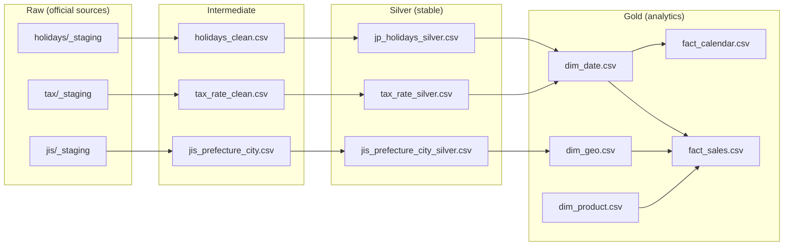
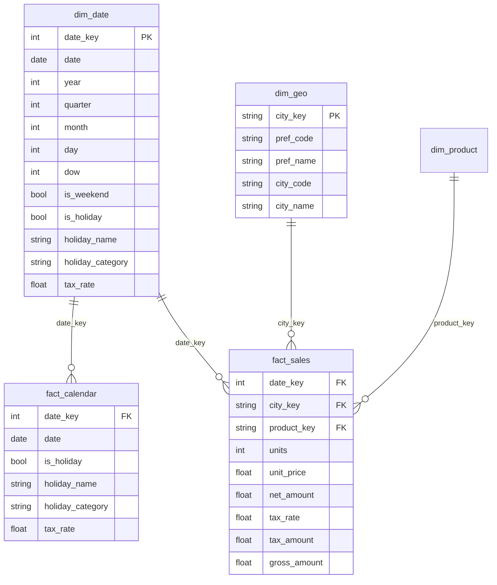

# Architecture & ERD

The pipeline uses a 4-layer Medallion pattern (Raw → Intermediate → Silver → Gold).

## Data Flow

```mermaid
flowchart LR
  subgraph Raw["Raw (official sources)"]
    H[holidays/_staging]
    J[jis/_staging]
    T[tax/_staging]
  end
  subgraph INT["Intermediate"]
    ih[holidays_clean.csv]
    ij[jis_prefecture_city.csv]
    it[tax_rate_clean.csv]
  end
  subgraph SIL["Silver (stable)"]
    sh[jp_holidays_silver.csv]
    sj[jis_prefecture_city_silver.csv]
    st[tax_rate_silver.csv]
  end
  subgraph GOLD["Gold (analytics)"]
    dd[dim_date.csv]
    dg[dim_geo.csv]
    fc[fact_calendar.csv]
    dp[dim_product.csv]
    fs[fact_sales.csv]
  end
  H-->ih
  J-->ij
  T-->it
  ih-->sh
  ij-->sj
  it-->st
  sh-->dd
  st-->dd
  sj-->dg
  dd-->fc
  dd-->fs
  dg-->fs
  dp-->fs
```

## Star Schema ERD

```mermaid
erDiagram
  dim_date ||--o{ fact_calendar : "date_key"
  dim_date ||--o{ fact_sales    : "date_key"
  dim_geo  ||--o{ fact_sales    : "city_key"
  dim_product ||--o{ fact_sales : "product_key"

  dim_date {
    int    date_key PK
    date   date
    int    year
    int    quarter
    int    month
    int    day
    int    dow
    bool   is_weekend
    bool   is_holiday
    string holiday_name
    string holiday_category
    float  tax_rate
  }

  dim_geo {
    string city_key PK
    string pref_code
    string pref_name
    string city_code
    string city_name
  }

  fact_calendar {
    int    date_key FK
    date   date
    bool   is_holiday
    string holiday_name
    string holiday_category
    float  tax_rate
  }

  fact_sales {
    int    date_key FK
    string city_key  FK
    string product_key FK
    int    units
    float  unit_price
    float  net_amount
    float  tax_rate
    float  tax_amount
    float  gross_amount
  }
```
